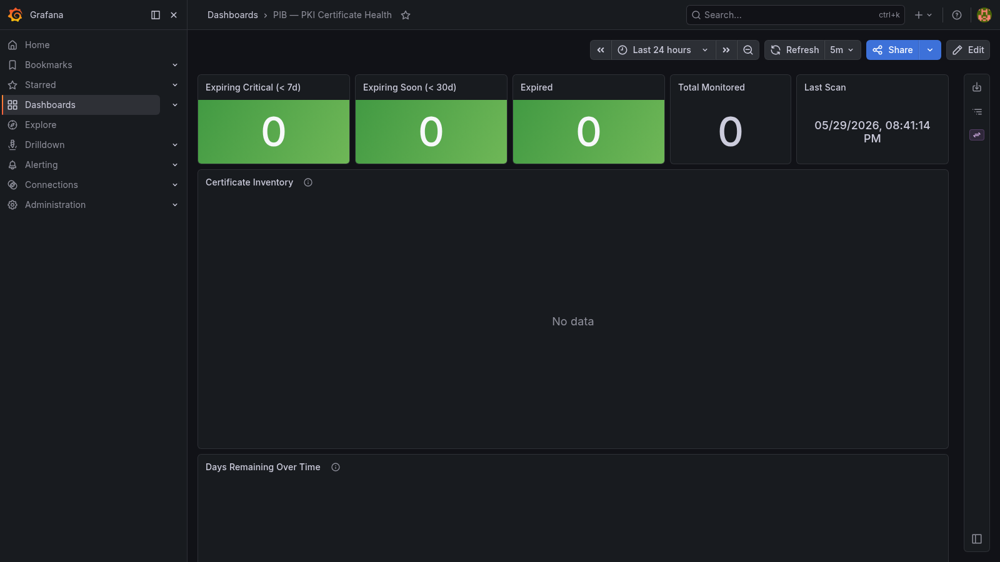

# PIB — PKI in a Box

**One `make up` to get a fully functional internal CA with ACME support and certificate expiry monitoring.**

PIB runs [step-ca](https://smallstep.com/docs/step-ca/) as a self-hosted root CA, issues certificates via the ACME protocol (so your services can auto-renew with `acme.sh` or `certbot`), and monitors all your TLS endpoints for expiry in Grafana.

Part of the [in-a-box-tools](https://in-a-box-tools.tech) ecosystem.



---

## What you get

| Component | Purpose |
|-----------|---------|
| **step-ca** | Root CA + ACME endpoint — issue and renew internal certs |
| **pib-monitor** | TLS cert expiry scanner — checks configured endpoints and the CA's own root + intermediate every 6h |
| **VictoriaMetrics** | Stores cert health metrics (365 day retention) |
| **Grafana** | Dashboard + provisioned alert rules: expiry countdown, cert inventory, CA chain health |

---

## Quick start

```bash
git clone https://github.com/matijazezelj/pib.git
cd pib
cp .env.example .env       # set CA_DNS_NAMES, GRAFANA_ADMIN_PASSWORD
make up                    # generates CA password + starts stack
```

On first start, `make up` generates a random CA password (`ca/password.txt`) and step-ca initialises a root CA. This takes about 10 seconds.

Open **http://localhost:3005** for the Grafana dashboard.

---

## Using the CA

### Get the root CA fingerprint

```bash
make ca-fingerprint
```

### Issue a cert via ACME (acme.sh)

```bash
acme.sh --issue \
  --server https://localhost:9000/acme/acme/directory \
  --domain myservice.internal \
  --webroot /var/www/html \
  --ca-bundle /path/to/pib-root-ca.crt
```

### Issue a cert via step CLI

```bash
step ca certificate myservice.internal cert.pem key.pem \
  --ca-url https://localhost:9000 \
  --fingerprint $(make ca-fingerprint)
```

### Trust the root CA

First export the root certificate:

```bash
docker cp pib-ca:/home/step/certs/root_ca.crt ./pib-root-ca.crt
```

```bash
# macOS / Windows / Linux (via step CLI)
step certificate install ./pib-root-ca.crt

# Ubuntu/Debian (manual)
sudo cp ./pib-root-ca.crt /usr/local/share/ca-certificates/pib-root-ca.crt
sudo update-ca-certificates
```

> Anchoring this CA lets it issue a trusted certificate for **any** domain on that
> machine. Only install it on hosts you control.

---

## Adding endpoints to monitor

In `.env`:

```env
MONITOR_HOSTS=pib-ca:9000,myservice.internal:443,grafana.internal:443
```

Or on a network where DNS resolves your services.

`CA_HOST` (default `pib-ca:9000`) is always prepended to this list, so overriding
`MONITOR_HOSTS` never stops you monitoring your own CA. Set `CA_HOST=` to opt out.

An endpoint that cannot be reached reports `pib_cert_check_success 0` and is
counted by `pib_certs_unreachable` — its "days remaining" figure is stale, not
healthy.

### The CA's own certificates

The root and intermediate are monitored automatically — no configuration. They
are read straight off the step-ca volume rather than over TLS, because neither
is ever served in a handshake, and because that still works when step-ca is down.

Only the volume's `certs/` subdirectory is mounted into the monitor, read-only.
`secrets/` — which holds both private keys and the CA passphrase in the clear —
is never exposed to it.

They get their own thresholds (`CA_WARN_DAYS` / `CA_CRITICAL_DAYS`, defaulting to
365 and 90 days) because replacing a root means re-anchoring trust on every
machine that trusts this CA. Thirty days' notice would not be enough.

### Short-lived certificates

A certificate whose entire lifetime is shorter than its warning window is judged
on how much of that lifetime is left, not on an absolute day count. step-ca's own
API certificate lives about 24 hours and renews itself, so "0 days remaining" is
its healthy steady state — the day count alone would report it CRITICAL forever.

This doubles as renewal monitoring: an ACME cert that quietly stops renewing
drops below the ratio and alerts long before it actually expires.

---

## Alerting

Alert rules are provisioned into Grafana automatically — no setup:

| Alert | Fires when |
|-------|-----------|
| Certificate expired | Any monitored cert is past its `notAfter` |
| Certificate expiring imminently | An endpoint cert enters the critical window |
| CA root or intermediate expiring | The CA chain crosses `CA_WARN_DAYS` |
| Endpoint unreachable | A configured endpoint fails checks for 30m |
| Monitor has stopped scanning | No completed scan in 12h — every other alert is blind |

The rules read `pib_cert_status`, which the monitor exports having already applied
your thresholds, so changing `WARN_DAYS` in `.env` changes the alerts too. They are
not restated in PromQL.

### Getting alerts delivered somewhere

Out of the box alerts fire and are visible under **Alerting** in Grafana, but are
not delivered. To send them to Slack, Discord, Teams, or any JSON webhook:

```bash
cp grafana/provisioning/alerting/contactpoints.yaml.example \
   grafana/provisioning/alerting/contactpoints.yaml
echo 'ALERT_WEBHOOK_URL=https://hooks.slack.com/services/...' >> .env
make restart
```

Set `ALERT_WEBHOOK_URL` before restarting. Grafana treats an empty `url` as fatal
and will refuse to start — which is why the contact point ships as `.example`
rather than active.

---

## Configuration

| Variable | Default | Description |
|----------|---------|-------------|
| `GRAFANA_ADMIN_PASSWORD` | `changeme` | Grafana admin password — **change this** |
| `GRAFANA_PORT` | `3005` | Host port for Grafana |
| `VICTORIAMETRICS_PORT` | `8433` | Host port for VictoriaMetrics |
| `CA_PORT` | `9000` | Host port for step-ca (ACME + API) |
| `CA_NAME` | `PIB Root CA` | Display name of the root CA |
| `CA_DNS_NAMES` | `localhost,pib-ca` | DNS names in the CA certificate |
| `MONITOR_HOSTS` | `pib-ca:9000` | Comma-separated `host:port` to monitor |
| `CA_HOST` | `pib-ca:9000` | Always prepended to `MONITOR_HOSTS`; set empty to opt out |
| `SCAN_INTERVAL_HOURS` | `6` | Monitor scan frequency |
| `SCAN_ON_STARTUP` | `true` | Run a scan immediately on container start |
| `WARN_DAYS` | `30` | Days remaining threshold for warning |
| `CRITICAL_DAYS` | `7` | Days remaining threshold for critical |
| `CA_WARN_DAYS` | `365` | Warning threshold for the root/intermediate |
| `CA_CRITICAL_DAYS` | `90` | Critical threshold for the root/intermediate |
| `ALERT_WEBHOOK_URL` | — | Webhook for alert delivery (see [Alerting](#alerting)) |
| `VICTORIAMETRICS_RETENTION` | `365d` | How long metrics are kept |
| `BIND_ADDR` | `127.0.0.1` | Host interface to publish ports on; `0.0.0.0` exposes to the LAN |

---

## Metrics

| Metric | Labels | Description |
|--------|--------|-------------|
| `pib_cert_days_remaining` | `host`, `kind`, `cn`, `issuer`, `sans` | Days until certificate expires |
| `pib_cert_expiry_timestamp` | `host`, `kind`, `cn`, `issuer`, `sans` | Expiry as Unix timestamp (ms) |
| `pib_cert_valid_days` | `host`, `kind`, `cn`, `issuer`, `sans` | Total validity period (days) |
| `pib_cert_not_yet_valid` | `host`, `kind`, `cn`, `issuer`, `sans` | `1` if the cert's `notBefore` is in the future |
| `pib_cert_status` | `host`, `kind`, `cn`, `issuer`, `sans` | `0` ok, `1` warning, `2` critical, `3` expired — thresholds already applied |
| `pib_cert_lifetime_remaining_ratio` | `host`, `kind`, `cn`, `issuer`, `sans` | Fraction of total validity still left (`1.0` = just issued) |
| `pib_cert_check_success` | `host`, `kind` | `1` if the target was checked this scan, `0` if it could not be reached |
| `pib_certs_total` | — | Total monitored certs |
| `pib_certs_expired` | — | Currently expired certs |
| `pib_certs_expiring_warning` | — | Certs expiring within `WARN_DAYS` |
| `pib_certs_expiring_critical` | — | Certs expiring within `CRITICAL_DAYS` |
| `pib_certs_unreachable` | — | Configured targets that could not be checked |
| `pib_last_scan_timestamp` | — | Last scan Unix timestamp (ms) |

`kind` is `endpoint` for anything in `MONITOR_HOSTS`, or `root` / `intermediate`
for the CA's own certificates.

---

## Useful commands

```bash
make up               # start the stack (generates CA password if needed)
make down             # stop
make logs             # follow all container logs
make scan-now         # trigger an immediate cert scan
make ca-fingerprint   # print root CA fingerprint (for trust anchoring)
make build            # rebuild monitor image
make clean            # stop and delete all volumes (destroys CA and data)
```

---

## In-a-box ecosystem

| Tool | What it does |
|------|-------------|
| [VIB](https://github.com/matijazezelj/vib) | Vulnerability in a Box — CVE scanning |
| [TIB](https://github.com/matijazezelj/tib) | Threat Intelligence in a Box — KEV + EPSS |
| [CIB](https://github.com/matijazezelj/cib) | Compliance in a Box — policy + license + EOL |
| [IIB](https://github.com/matijazezelj/iib) | Identity in a Box — SSO, IdP, login metrics |
| **PIB** | **PKI in a Box** |

---

## License

MIT
